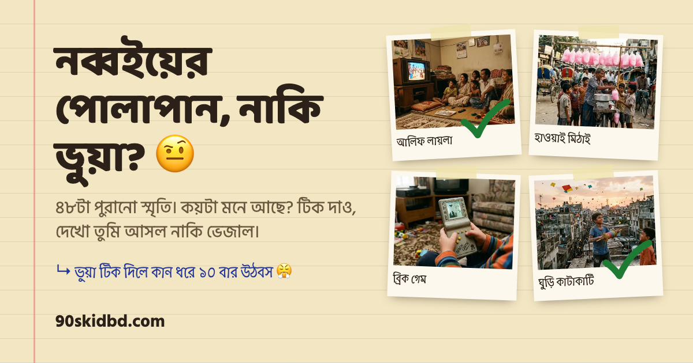

# নব্বইয়ের শিশু (90s Kid of Bangladesh)

**নব্বইয়ের পোলাপান, নাকি ভুয়া? 🤨**

### ▶ Play it: [90skidbd.dhrupo.workers.dev](https://90skidbd.dhrupo.workers.dev/)

A Bangla nostalgia checklist for people who grew up in 1990s–early 2000s Bangladesh. Tick the memories you remember, get a 90s-style school marksheet, post it on Facebook, and challenge a friend to beat your score.

[](https://90skidbd.dhrupo.workers.dev/)

## How it works

1. **Tick memories.** 60 photo cards in 6 chapters: টিভি, টিফিন, স্কুল, খেলা, গ্যাজেট and ঈদ. Tap a card to give it a green teacher's tick.
2. **Hand in your khata.** A sticky bar appears after the first tick. Tap it to open the result: a score, a funny title, and the class teacher's remark.
3. **Get your marksheet.** A 1080×1350 "মার্কশিট" image shows your marks per subject, grades, total, a photo strip and a পাস/ফেল stamp.
4. **Share and challenge.** Facebook, X and WhatsApp share your score with a challenge link that carries your ticks and name. Instagram, "more" and save use the marksheet picture. A friend who opens the link plays first, then sees how you compare.

### Grades (SSC scale)

| Score | Grade | Title |
|---|---|---|
| ৮০–১০০% | A+ | বিটিভির লোগো তুমি নিজেই 📺 |
| ৭০–৭৯% | A | পাক্কা নব্বইয়ের পোলাপান 🎒 |
| ৬০–৬৯% | A- | নব্বইয়ের ভালো ছাত্র 📚 |
| ৫০–৫৯% | B | হাফ-টিফিন নব্বই 🍬 |
| ৪০–৪৯% | C | আধা নব্বই, আধা ইউটিউব 📱 |
| ৩৩–৩৯% | D | টেনেটুনে পাস 😅 |
| ০–৩২% | F | ২০০০-এর পরের বাচ্চা 🍼 |

Each grade has its own pool of teacher remarks. Subjects on the marksheet are graded on the same scale, and below 33% gets the red **ফেল** stamp.

## Privacy

There's no server, database, account or cookie:
- Ticks are saved only in your own browser (`localStorage`).
- A challenge link carries the ticks and the optional name inside the link itself (`#c=…&n=…`). They're never sent anywhere.
- Names from a link are always shown as plain text and cut to 20 characters.

## Tech

- Plain HTML, CSS and JavaScript (ES modules). **No framework and no build step.**
- The share image is drawn with the browser's Canvas API.
- The result pop-up is a native `<dialog>`.
- Fonts: Hind Siliguri, Baloo Da 2 and Atma (Google Fonts).
- Tests: Node's built-in test runner for the score logic, and Playwright for the browser (Android Chrome + iPhone Safari profiles).

```
index.html          the page
src/items.js        the 60 memories, chapters and all the random lines
src/score.js        percent, tiers, challenge-link packing, comparison
src/main.js         ticking, toasts, sticky bar, result pop-up, challenge
src/share.js        draws the marksheet image and shares/downloads it
src/style.css       khata scrapbook look and animations
photos/             400×300 WebP thumbnails, one per memory
scripts/thumbs.sh   turns a folder of photos into thumbnails
tests/              unit tests + Playwright E2E specs
```

## Run locally

Needs Node 20+ and Python 3.

```bash
npm install
npm run serve          # http://localhost:4173
```

## Tests

```bash
npm test               # unit tests (node --test)
npx playwright install chromium webkit   # first time only
npm run e2e            # browser tests against the local site
```

## Adding your own photos

Name each photo after its item id from `src/items.js` (for example `alif-laila.jpg`), put them in one folder, then run:

```bash
scripts/thumbs.sh path/to/photos   # writes photos/<id>.webp (400×300, center-cropped)
```

This needs macOS `sips` and `cwebp`.

> **Item order matters.** Challenge links store ticks by position. Once the site is live, only **add** new items at the end. Don't reorder or remove items, or old challenge links will point at the wrong memories.

## Deploy (Cloudflare)

The repo is connected to Cloudflare Workers Builds. Each push to `main` runs `npx wrangler deploy`, which serves the site as static assets using `wrangler.jsonc`.
- `.assetsignore` keeps everything except the site out of the upload, so only `index.html`, `src/`, `photos/` and `og.png` go live. Add any new non-site files or folders there.
- Check what would upload with `npx wrangler deploy --dry-run`.

Live at **https://90skidbd.dhrupo.workers.dev/**. The Facebook preview tags (`og:url`, `og:image`) in `index.html` must hold the live address. Update them when the address changes. The marksheet and share text print the current address on their own.

## Photo removal

The current photos are stand-ins. If one of them is yours and you want it removed, email **dhrupo@gmail.com**.

---

Made by [dhrupo](https://github.com/dhrupo).
